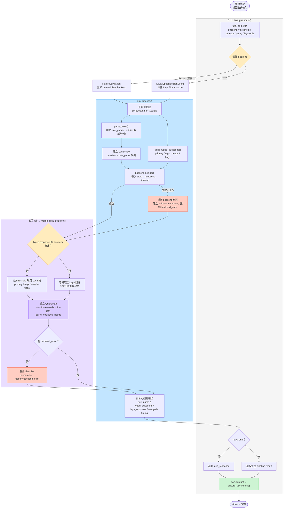

# 專案流程圖

此圖依據 `src/laya_flow/cli.py`、`src/laya_flow/pipeline.py`、`src/laya_flow/rules.py`、`src/laya_flow/questions.py`、`src/laya_flow/laya.py` 與 `src/laya_flow/policy.py` 的目前實作整理，描述 CLI 到最終 JSON 輸出的主流程。

## 流程重點

- `parse_rules` 先產生 deterministic 規則解析結果；`state` 與 typed questions 再一併交給選定的 backend。
- `build_typed_questions` 只詢問受限的 intent、need 與 flag，不要求 Laya 生成回答內容。
- backend 可能是離線 fixture 或本機 Laya；backend 失敗時仍會繼續由規則與政策完成合併。
- `merge_laya_decision` 會先檢查 typed response，再依 threshold 驗證 Laya 回應，並以 `laya_needs ∪ rule_based_needs ∪ policy_required_needs` 建立候選 needs，再套用 `policy_excluded_needs` 閘門。
- 預設輸出保留 `rule_parse`、原始 `laya_response`、`merged` 與 `timing`；`--laya-only` 只輸出 Laya 回應。
